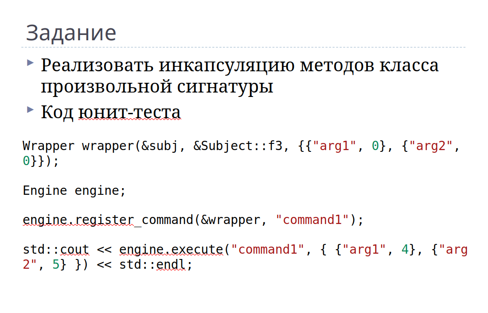

# Лабораторная 2

## Задание

Всё, что у нас есть.

## Сборка примера
- cmake -S . -B build
- cmake --build build

Если у вас Windows, скомпилированный файл окажется в build/bin/Debug

## О классе Wrapper

Из скриншота можно предположить, что требуется следующий вариант конструктора:

- **Указатель на объект, чей метод оборачивается.**

  **Внимание!** Предполагается, что передаваемый объект может как создаваться на стеке, так и через new. В связи с этим, внутри Wrapper хранится сырой указатель, и пользователь должен сам отвечать за существование объекта.

- **Ссылка на метод класса.**

- **Словарь из передаваемых аргументов по умолчанию.**

  Имена ключей могут быть произвольными. На этапе создания обёртки учитывается только порядок, в котором пары *ключ-значение* перечисляются. В случае несовпадений типов или количества переданных словарём аргументов функции с её сигнатурой, произойдёт исключение `invalid_argument`.

## О классе Engine

Конструктор не принимает никаких параметров.

### register_command()

Принимает в себя:

- **Указатель на обёртку**

  **Внимание!** Аналогично предыдущему случаю, engine хранит в себе сырой указатель. Будьте внимательны с существованием объекта Wrapper.

- **Наименование команды, с которым будет сопоставляться обёртка.**

### execute_command()

Принимает в себя:

- **Наименование соответствующей желанной команды.**

- **Словарь, в котором по заранее заданным ключам для аргументов задаются значения, отличные от дефолтных.**

Если передаётся незарегистрированный ключ, или типы передаваемых значений отличаются от заданных, то выкидывается исключение `invalid_argument`.

Возвращает тип `ExecuteResult`, который в свою очередь приводится через user-defined conversion operator к типу, который возвращает обёрнутый метод.

Чтобы соответствовать скрину с заданием, пришлось специально перегрузить оператор `std::cout`.
